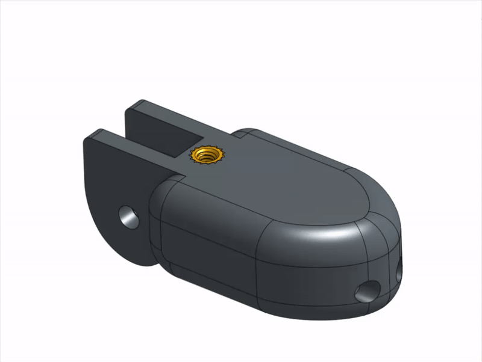
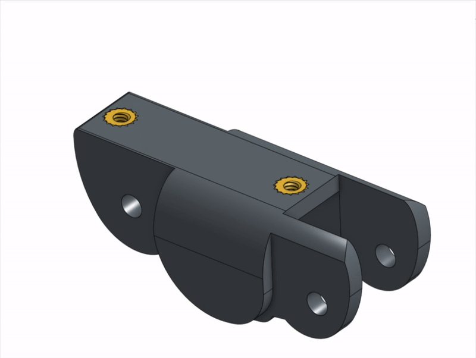

# Step 01 — Heat Insert Tutorial

### Tutorials for Heat Set Inserts

In addition to the video instructions, using a razor blade to push the heat-set insert in for the last millimeter or so is helpful. This ensures it is flush with the surface.



### Materials

#### Tools

* Soldering Iron
* Soldering Tips
* Razor Blade

#### 3D Printed Parts

Please prepare all the 3D printed parts, almost all of them will be used in this section

#### Hardware (Inserts)

<table><thead><tr><th width="202.56640625">Part Name</th><th width="144.5703125">Total Quantity</th></tr></thead><tbody><tr><td>M2 x 2 x 3.5 mm insert</td><td></td></tr><tr><td>M2 x 4 x 3.5 mm insert</td><td></td></tr><tr><td>M2 x 6 x 3.5 mm insert</td><td></td></tr><tr><td>M2 x 8 x 3.5 mm insert</td><td></td></tr><tr><td>M3 x 4 x 5 mm insert</td><td></td></tr><tr><td>M3 x 6 x 5 mm insert</td><td></td></tr><tr><td>M5 x 6 x 7 mm insert</td><td></td></tr></tbody></table>

### Instructions

#### 1. Fingers (Index, Middle, Ring)

<table><thead><tr><th width="243.015625">Part Name</th><th width="223.03515625">Quantity</th></tr></thead><tbody><tr><td>M2 x 2 x 3.5 Heat Set Inserts</td><td>2</td></tr><tr><td>M2 x 4 x 3.5 Heat Set Inserts</td><td>3</td></tr></tbody></table>

| Joint 1                                                                             | Joint 2                                                               | Joint 3                                                                             |
| ----------------------------------------------------------------------------------- | --------------------------------------------------------------------- | ----------------------------------------------------------------------------------- |
| \[1] M2 x 4 x 3.5                                                                   | \[2] M2 x 2 x 3.5                                                     | \[2] M2 x 4 x 3.5                                                                   |
| 

 |  | 

 |

#### 2. Pinky

<table><thead><tr><th width="243.015625">Part Name</th><th width="223.03515625">Quantity</th></tr></thead><tbody><tr><td>M2 x 3 x 3.5 Heat Set Inserts</td><td>2</td></tr><tr><td>M2 x 4 x 3.5 Heat Set Inserts</td><td>3</td></tr></tbody></table>

| Joint 1                                                                                 | Joint 2                                                                                 | Joint 3                                                                   |
| --------------------------------------------------------------------------------------- | --------------------------------------------------------------------------------------- | ------------------------------------------------------------------------- |
| \[1] M2 x 4 x 3.5                                                                       | \[2] M2 x 3 x 3.5                                                                       | \[2] M2 x 4 x 3.5                                                         |
| 

 | 

 |  |

#### 3. Thumb

<table><thead><tr><th width="243.015625">Part Name</th><th width="223.03515625">Quantity</th></tr></thead><tbody><tr><td>M2 x 3 x 3.5 Heat Set Inserts</td><td></td></tr><tr><td>M2 x 4 x 3.5 Heat Set Inserts</td><td></td></tr><tr><td></td><td></td></tr></tbody></table>

#### 4. Knuckle

<table><thead><tr><th width="243.015625">Part Name</th><th width="223.03515625">Quantity</th></tr></thead><tbody><tr><td>M2 x 3 x 3.5 Heat Set Inserts</td><td></td></tr><tr><td>M2 x 4 x 3.5 Heat Set Inserts</td><td></td></tr><tr><td></td><td></td></tr></tbody></table>

#### 5. Palm & Backhand

<table><thead><tr><th width="243.015625">Part Name</th><th width="223.03515625">Quantity</th></tr></thead><tbody><tr><td>M2 x 3 x 3.5 Heat Set Inserts</td><td></td></tr><tr><td>M2 x 4 x 3.5 Heat Set Inserts</td><td></td></tr><tr><td></td><td></td></tr></tbody></table>

#### 6. Wrist

<table><thead><tr><th width="243.015625">Part Name</th><th width="223.03515625">Quantity</th></tr></thead><tbody><tr><td>M2 x 3 x 3.5 Heat Set Inserts</td><td></td></tr><tr><td>M2 x 4 x 3.5 Heat Set Inserts</td><td></td></tr><tr><td></td><td></td></tr></tbody></table>

#### 7. Top Motor Panel

<table><thead><tr><th width="243.015625">Part Name</th><th width="223.03515625">Quantity</th></tr></thead><tbody><tr><td>M2 x 3 x 3.5 Heat Set Inserts</td><td></td></tr><tr><td>M2 x 4 x 3.5 Heat Set Inserts</td><td></td></tr><tr><td></td><td></td></tr></tbody></table>

#### 8. Motor Base

<table><thead><tr><th width="243.015625">Part Name</th><th width="223.03515625">Quantity</th></tr></thead><tbody><tr><td>M2 x 3 x 3.5 Heat Set Inserts</td><td></td></tr><tr><td>M2 x 4 x 3.5 Heat Set Inserts</td><td></td></tr><tr><td></td><td></td></tr></tbody></table>

