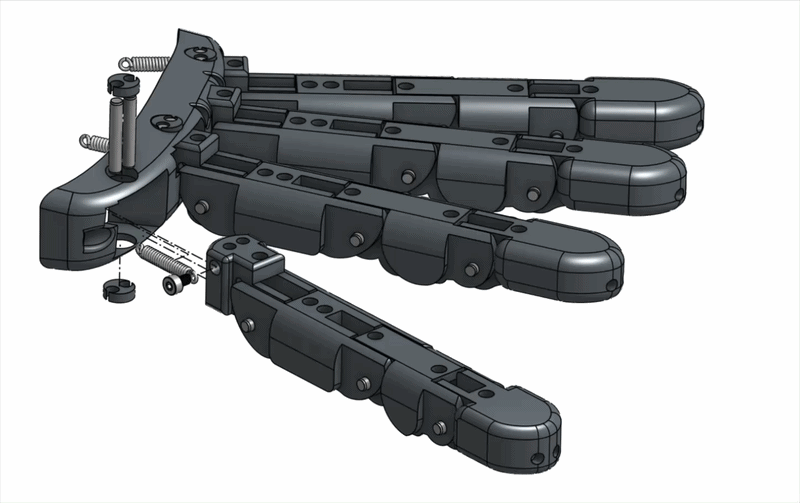

# Step 02 — Finger Assembly

## Index, Middle & Ring&#x20;

| Index                                   |                                    |
| --------------------------------------- | ---------------------------------- |
| .gif>) |  |

| Middle |   |
| ------ | - |
|        |   |

| Ring |   |
| ---- | - |
|      |   |

## Pinky

| Pinky                                                                              |                                    |
| ---------------------------------------------------------------------------------- | ---------------------------------- |
| 

 |  |

## Thumb

<figure><figcaption></figcaption></figure>

