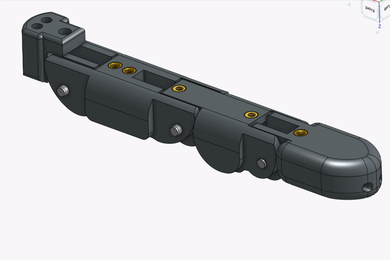
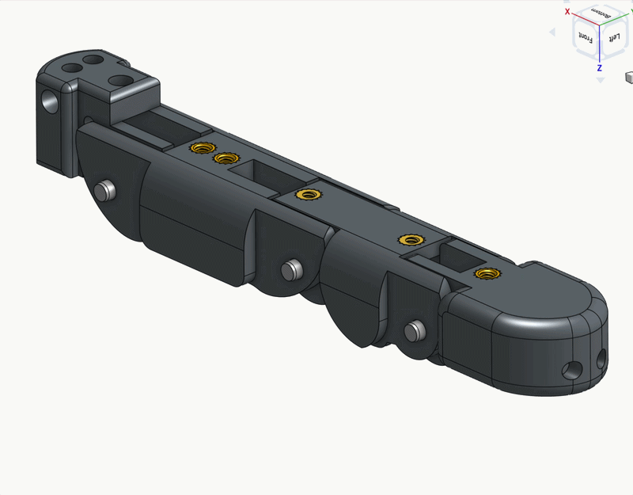

# Step 02 — Finger Assembly

## Index, Middle & Ring&#x20;

### 1. Attach String to Joint 3

<table><thead><tr><th width="241.29296875">Part Name</th><th width="159.8203125">Quantity</th></tr></thead><tbody><tr><td>String</td><td>~1 m</td></tr><tr><td>Finger Joint 3 / Pinky Joint 3</td><td>1</td></tr></tbody></table>

video coming soon

| <ol><li>Put both ends of the string in the holes.</li></ol>                                                                                        | <ol start="2"><li>Pull them through</li></ol>                                        | <ol start="3"><li>Taking both ends of the string tie a slip knot using the following steps.</li></ol> |
| -------------------------------------------------------------------------------------------------------------------------------------------------- | ------------------------------------------------------------------------------------ | ----------------------------------------------------------------------------------------------------- |
|                                                                                                                                                    |                                                                                      |                                                                                                       |
| <ol start="4"><li>Tighten the slipknot and trim the blue end.</li></ol>                                                                            | <ol start="5"><li>Push the knot into the joint. This may require tweezers.</li></ol> | <ol start="6"><li>Feed the string to the other side of the pulley.</li></ol>                          |
|                                                                                                                                                    |                                                                                      |                                                                                                       |
| <ol start="7"><li>Repeat the same process three times, feed one string through the back of the finger, two strings through the otherside</li></ol> |                                                                                      |                                                                                                       |
|                                                                                                                                                    |                                                                                      |                                                                                                       |

### 2. Attach String to Joint 1

<table><thead><tr><th width="241.29296875">Part Name</th><th width="159.8203125">Quantity</th></tr></thead><tbody><tr><td>String</td><td>~1 m</td></tr><tr><td>Finger Joint 1 / Pinky Joint 1</td><td>1</td></tr></tbody></table>

video coming soon

| <ol><li>Pull string through hole.</li></ol>                                 | <ol start="2"><li>Tie slip knot (same as previous step).</li></ol> |
| --------------------------------------------------------------------------- | ------------------------------------------------------------------ |
|                                                                             |                                                                    |
| <ol start="3"><li>Tighten the knot and feed it through the joint.</li></ol> | <ol start="4"><li>Pull the string through the joint.</li></ol>     |
|                                                                             |                                                                    |

### 3. Attach Coupling Strings

<table><thead><tr><th width="241.29296875">Part Name</th><th width="159.8203125">Quantity</th></tr></thead><tbody><tr><td>M2 * 10 screws (temporary)</td><td>2</td></tr><tr><td>Finger Joint 1 / Pinky Joint 1</td><td>1</td></tr><tr><td>Finger Joint 2 / Pinky Joint 2</td><td>1</td></tr><tr><td>Finger Joint 3 / Pinky Joint 3</td><td>1</td></tr></tbody></table>

1. Use M2 screws to temporarly connect three joints.&#x20;
2. Route strings as shown below

<figure><figcaption></figcaption></figure>

3. Curve the finger, then make a slip knot at the other end of the red string, fix with a screw and check if it is in tension.
4. Tie a fix knot on the purple string, adjust the knot position so that the string is in tension



| Index Finger                                |                                    |
| ------------------------------------------- | ---------------------------------- |
|  (1).gif>) |  |

The ring finger assembly is the same as the index finger, but uses the mirrored abduction joint.&#x20;

The middle finger does not use the abduction joint.&#x20;

## Pinky

| Pinky Finger                                                                           |                                    |
| -------------------------------------------------------------------------------------- | ---------------------------------- |
| 

 |  |

## Thumb

<figure><figcaption></figcaption></figure>

