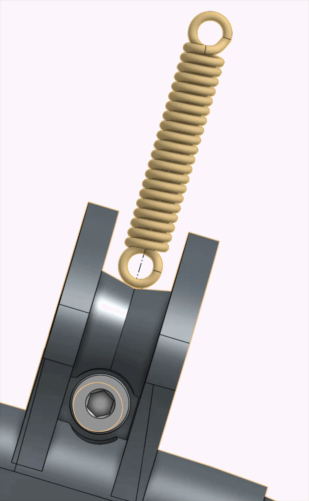
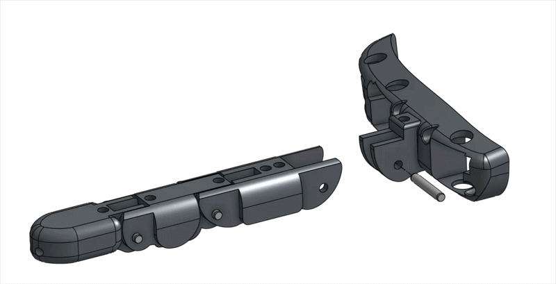
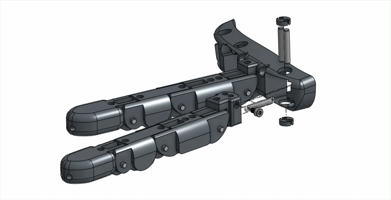
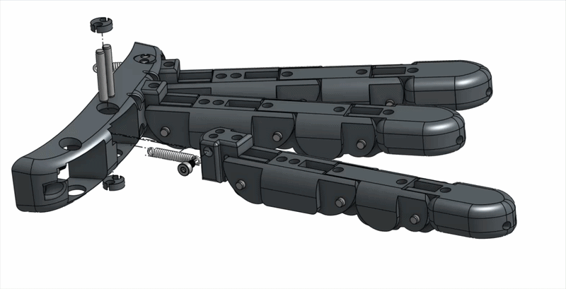

# Step 03 — Knuckle Assembly

### 1. Before Assembly

Things to check:

* The abduction / Adduction surface should be smooth enough
  * Surfaces that need to be polished
  *
* Finger tendons are coming out from the correct place

### 2. Assembly Instruction



#### Middle Finger Assembly

| Required Parts                              | Number |
| ------------------------------------------- | ------ |
| Middle Finger                               | 1      |
| Knuckle                                     | 1      |
| Dowel                                       | 1      |
| Extension Spring 0.016"x0.16"x0.59" (Short) | 1      |
| M2 \* 4 Screw                               | 1      |

#### Attach Spring

<figure><figcaption></figcaption></figure>

#### Attach Middle Finger

Before inserting the dowels, route the two strings into the two corresponding holes on the knuckle.

<figure><figcaption></figcaption></figure>

#### Index Finger Assembly

| Required Parts                             | Number |
| ------------------------------------------ | ------ |
| Index Finger                               | 1      |
| Knuckle                                    | 1      |
| Dowel                                      | 2      |
| Extension Spring 0.016"x0.16"x0.79" (long) | 1      |
| M2 \* 3 Screw                              | 1      |
| Knuckle Cap                                | 2      |

#### Attach Index Finger

1. Use M2 \* 3 screw to fix the spring on the abduction joint. <mark style="color:$danger;">CAUTION: Do not tighten the screw too much, as it may extrude from the heat insert and obscure the dowel pin insertion.</mark>
2. Insert the index finger into the knuckle, and check if it moves freely.
3. Insert two dowel pins, and put the cap on, check the movement again.&#x20;

<figure><figcaption></figcaption></figure>

#### Ring Finger Assembly

| Required Parts                             | Number |
| ------------------------------------------ | ------ |
| Ring Finger                                | 1      |
| Knuckle                                    | 1      |
| Dowel                                      | 2      |
| Extension Spring 0.016"x0.16"x0.79" (long) | 1      |
| M2 \* 3 Screw                              | 1      |
| Knuckle Cap                                | 2      |

#### Attach Ring Finger

1. Use M2 \* 3 screw to fix the spring on the abduction joint. <mark style="color:$danger;">CAUTION: Do not tighten the screw too much, as it may extrude from the heat insert and obscure the dowel pin insertion.</mark>
2. Insert the ring finger into the knuckle, and check if it moves freely.
3. Insert two dowel pins, and put the cap on, check the movement again.&#x20;

<figure><figcaption></figcaption></figure>

#### Pinky Finger Assembly

| Required Parts                             | Number |
| ------------------------------------------ | ------ |
| Pinky Finger                               | 1      |
| Knuckle                                    | 1      |
| Dowel                                      | 2      |
| Extension Spring 0.016"x0.16"x0.79" (long) | 1      |
| M2 \* 3 Screw                              | 1      |
| Knuckle Cap                                | 2      |

1. Use M2 \* 3 screw to fix the spring on the abduction joint. <mark style="color:$danger;">CAUTION: Do not tighten the screw too much, as it may extrude from the heat insert and obscure the dowel pin insertion.</mark>
2. Insert the pinky finger into the knuckle, and check if it moves freely.
3. Insert two dowel pins, and put the cap on, check the movement again.&#x20;

<figure><figcaption></figcaption></figure>

### 3. After Assembly

Things to check:

* Try to push the abduction/adduction joint, see if it can move freely.&#x20;
* Try to pull the strings and see if fingers can bend.

### 4. Troubleshooting

* Why is my abduction/adduction joint stuck at one position?
  * Have you polished the joint contact surfaces?
  * Have you polished the hole for abduction caps on the knuckle?
