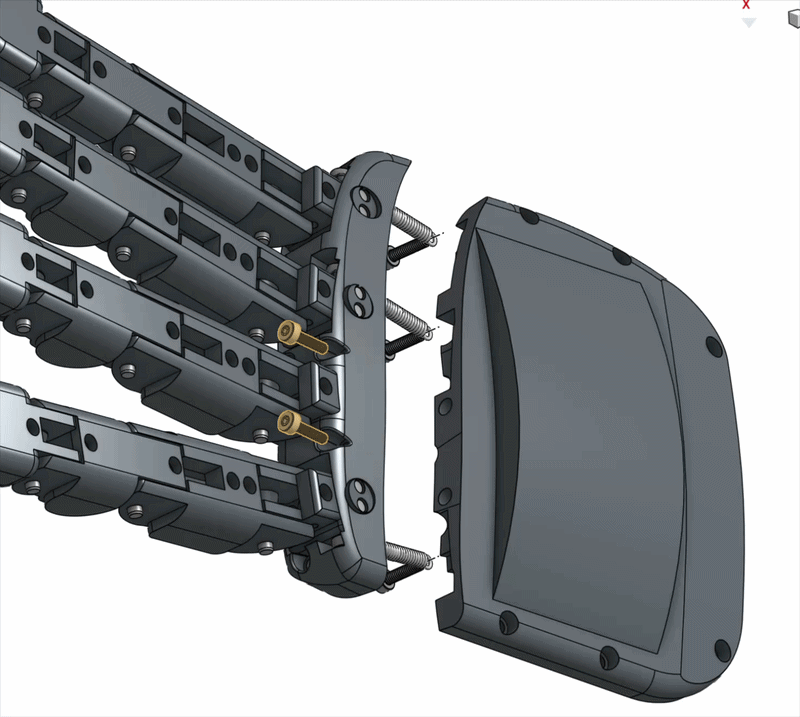
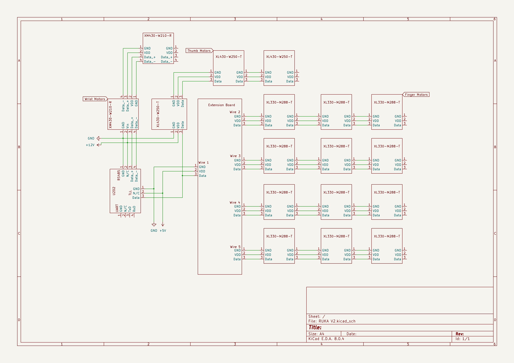
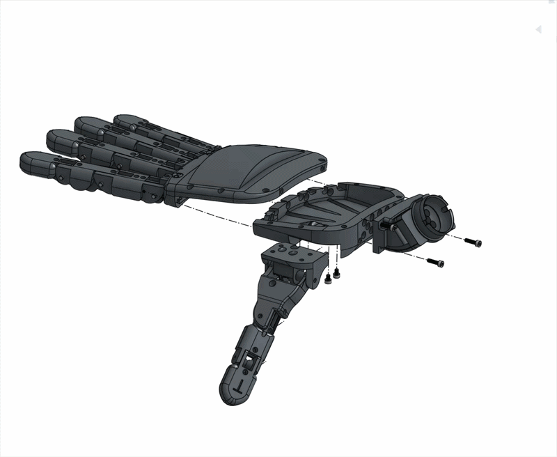

# Step 04 — Palm Assembly

### 1. Before Assembly

Double-check that the knuckle part and the thumb are fully functional.

### 2. Assembly

#### Backhand Assembly

| Required Parts | Number |
| -------------- | ------ |
| Backhand       | 1      |
| Knuckle        | 1      |
| M2 \* 6 Screw  | 5      |
| M2 Washer      | 3      |

1. Use two M2 \* 6 screws to fix the knuckle on the backhand.
2. Put the washer on the screw, then fix the springs on the backhand.&#x20;

<figure><figcaption></figcaption></figure>

#### Palm Assembly

| Required Parts   | Number |
| ---------------- | ------ |
| Knuckle+Backhand | 1      |
| Palm             | 1      |
| Thumb            | 1      |
| Wrist Connector  | 1      |
| M2 \* 4 Screw    | 4      |
| M2 \* 6 Screw    | 13     |
| PTFE Tube        |        |

1. Route PTFE tubes following the schema below.

<figure><figcaption></figcaption></figure>

2. Attach the wrist connector to the palm, carefully adjust the PTFE tube positions, and ensure that they are not extruding.
3. Route all finger tendons through PTFE tubes.
4. Slide in the thumb, use four M2 \* 4 screws to fix it.
5. Slide in the knuckle + backhand, use M2 \* 6 screws to fix it on the palm. <mark style="color:$danger;">CAUTION: Check the abduction joint again; if they can not move freely, try to loosen the screws attaching the knuckle and palm.</mark>

<figure><figcaption></figcaption></figure>

### 3. After Assembly

Things to check:

* Try to push the abduction/adduction joint, see if it can move freely.&#x20;
* Check that the PTFE tubes do not exceed the wrist connector inner surface.
* Try to pull the strings and see if fingers can bend.

### 4. Troubleshooting

* Why is my abduction/adduction joint stuck at one position?
  * Is the PTFE tube extruding out from the knuckle? If so, adjust the PTFE tube position.
