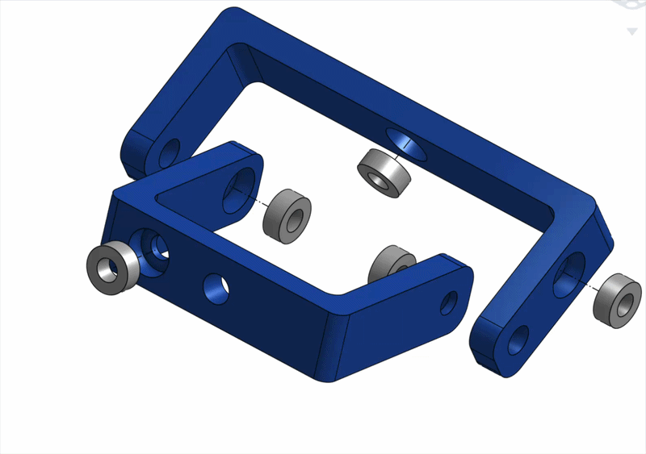
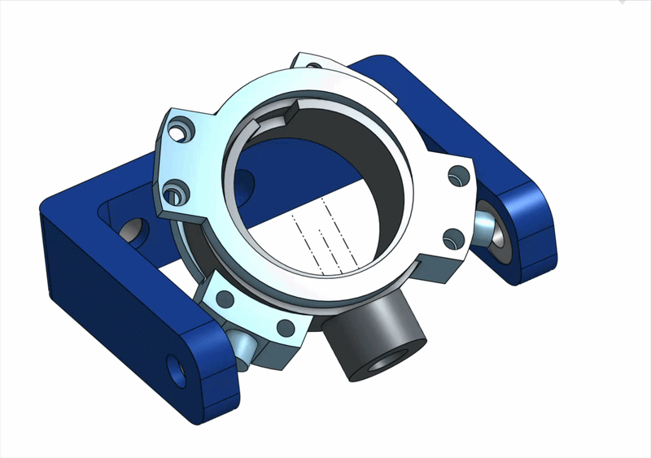
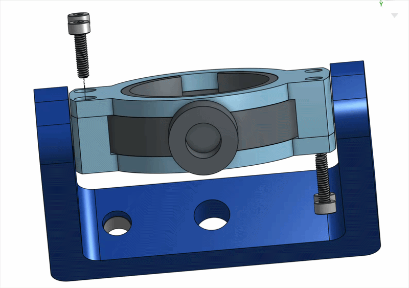
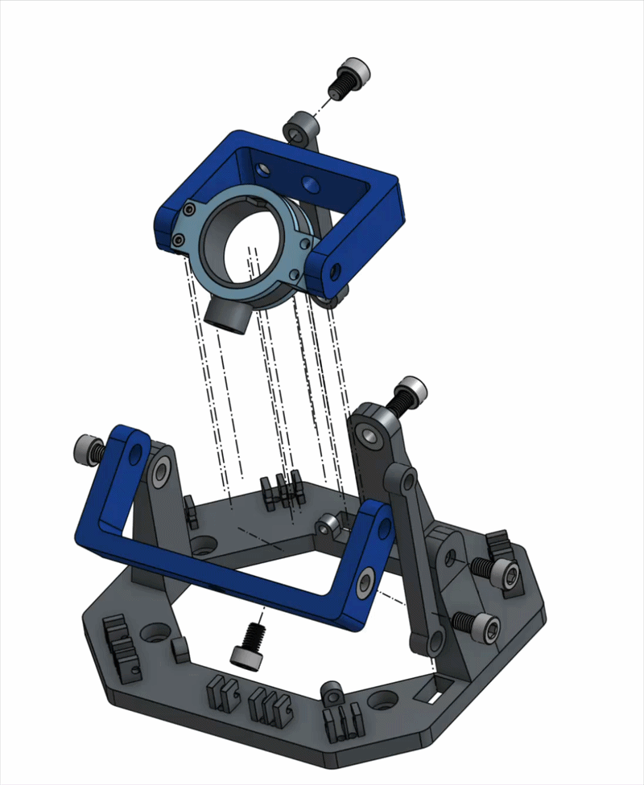
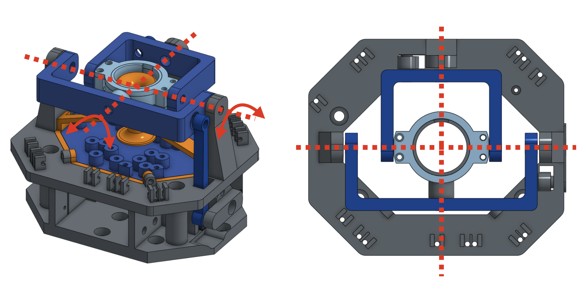
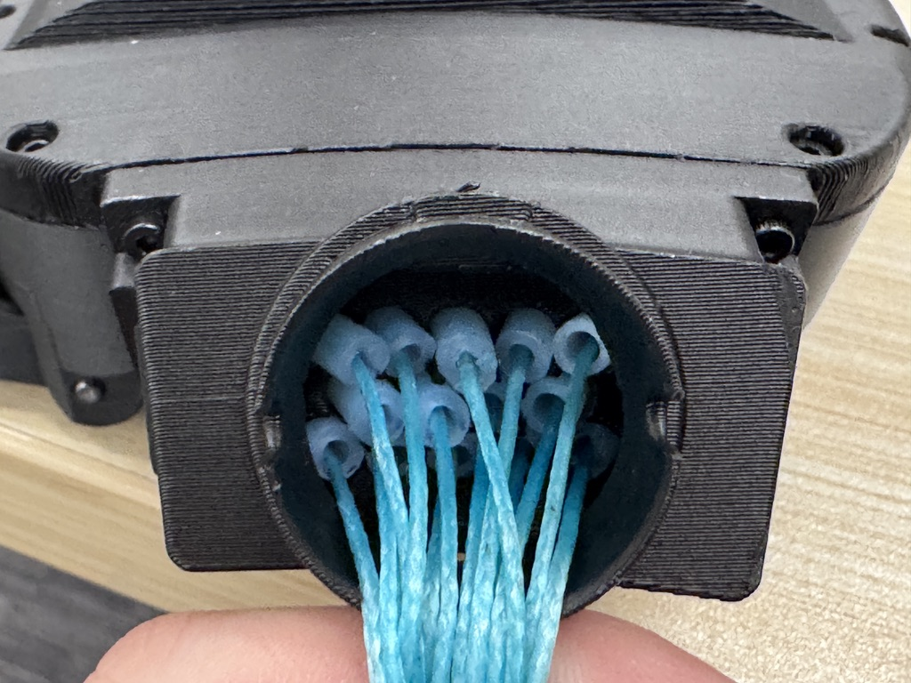

# Step 05 — Wrist Assembly

### 1. Before Assembly

* Make sure that the ball joint is polished, and test it with the wrist connector; it should move freely.

### 2. Assembly Instruction



#### Bearings Insertion

| Required Parts                | Number |
| ----------------------------- | ------ |
| Base                          | 1      |
| Inner Linkage                 | 1      |
| Outer Linkage                 | 1      |
| Bearings (10mm OD, 5mm Inner) | 8      |

<mark style="color:$danger;">Suggestion: Use a bench clamp if it is difficult to press in.</mark>

<figure><figcaption></figcaption></figure>

<figure><figcaption></figcaption></figure>

#### Wrist Assembly

| Required Parts | Number |
| -------------- | ------ |
|                |        |
|                |        |
|                |        |

1. Press the wrist connector into the inner linkage.&#x20;

<figure><figcaption></figcaption></figure>

2. Use four M2 \* 12 screw to fix it. <mark style="color:$danger;">CAUTION: Do not over-tighten the screws; make sure that the grey part moves freely.</mark>&#x20;

<figure><figcaption></figcaption></figure>

3. Assemble the wrist as shown below. Please refer to the assembly video for more specific steps.

<mark style="color:$danger;">Please use washers between moving parts.</mark>

<mark style="color:$danger;">Adjust the washer numbers between parts to ensure that the rotation center is at the center of the ball joint.</mark>

<figure><figcaption></figcaption></figure>

<figure><figcaption></figcaption></figure>

#### Wrist Routing



Things to Prepare:

* Tape
* Tweezers

Things to Pay Attention:

* Make sure that the strings are not entangling with each other.
* &#x20;Verify finger movement after routing.

Steps:

1. Group and tape the strings at the wrist connector.

<figure><figcaption></figcaption></figure>

2. Route the strings through the wrist group by group, and check for overlapping during the process.
3. &#x20;

<figure><figcaption></figcaption></figure>


