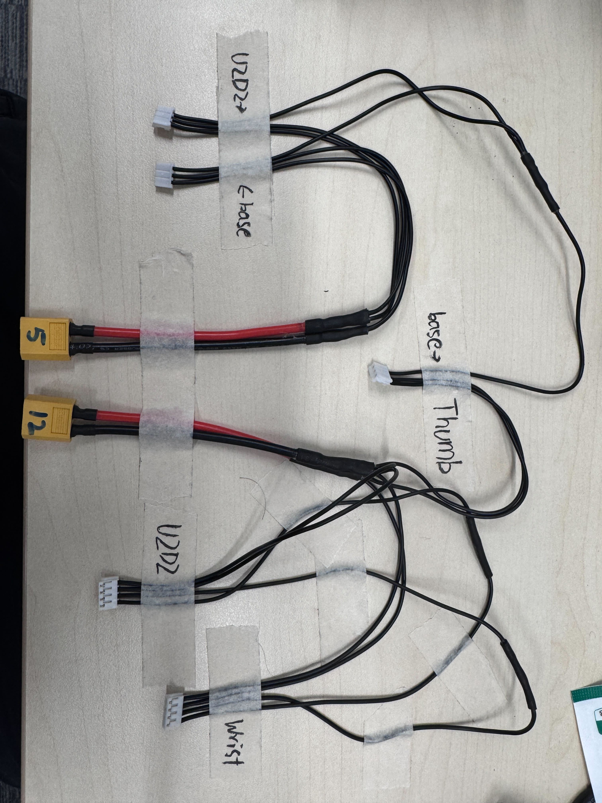

# Step 06 — Wiring and Motor IDs

### Solder

<table><thead><tr><th width="296.61328125">Part Name</th><th width="140.8671875">Total Quantity</th></tr></thead><tbody><tr><td>XT60 Connector Pigtails</td><td>2</td></tr><tr><td>Dynamixel Cables (3 pin) cut in half</td><td>3</td></tr><tr><td>Dynamixel Cables (4 pin) cut in half</td><td>2</td></tr></tbody></table>

Using the following schema, solder the ground cables two 3-pin connectors to the ground wire of the XT60 pigtail (5V), and same for the power. Then solder the ground cables two 4-pin connectors and one 3-pin connector to the ground wire of the XT60 pigtail (12V), and same for the power. Take the three 3-pin connectors' data wires and solder them together, then solder two 4-pin connector's data cable together.

<figure><figcaption></figcaption></figure>

<figure><figcaption></figcaption></figure>

### Motor Wiring

<figure><figcaption></figcaption></figure>

### Motor IDs
