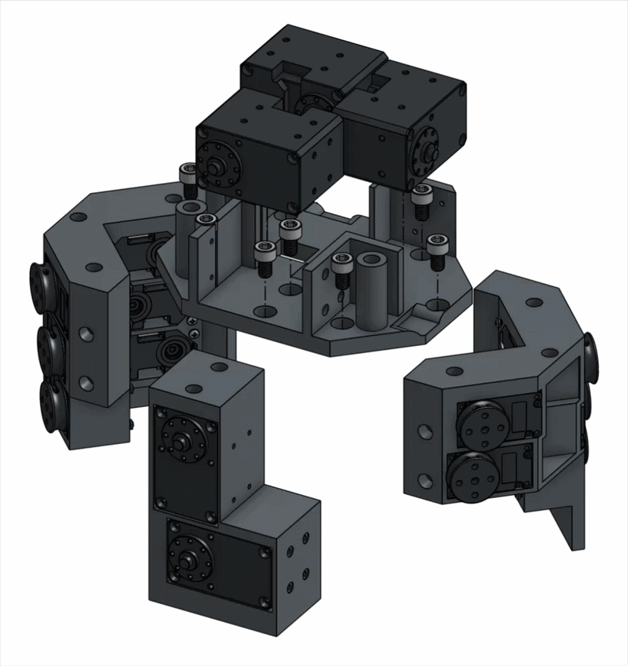

# Step 07 — Motor Base Assembly

<table><thead><tr><th width="252.9453125">Required Parts</th><th width="107.97265625">Quantity</th></tr></thead><tbody><tr><td>DYNAMIXEL XL330-M288-T</td><td>11</td></tr><tr><td>DYNAMIXEL XL430-W250-T</td><td>3</td></tr><tr><td>DYNAMIXEL XM430-W210-R</td><td>2</td></tr><tr><td>5-Base</td><td>1</td></tr><tr><td>6-Base</td><td>1</td></tr><tr><td>Thumb Base</td><td>1</td></tr><tr><td>Motor-Top</td><td>1</td></tr></tbody></table>



1. Attach motors in the motor base following the motor ID graph. (Motor 15, 16: W210R)

<figure><figcaption></figcaption></figure>

2. Assemble the base.

<figure><figcaption></figcaption></figure>
